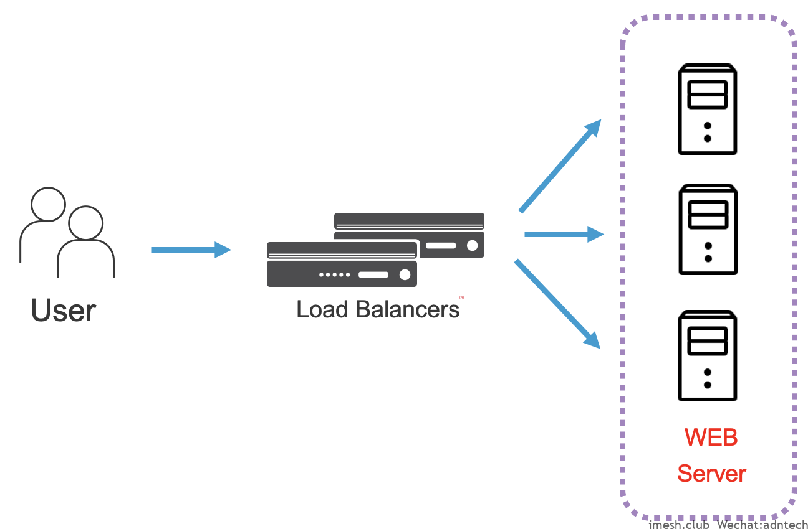
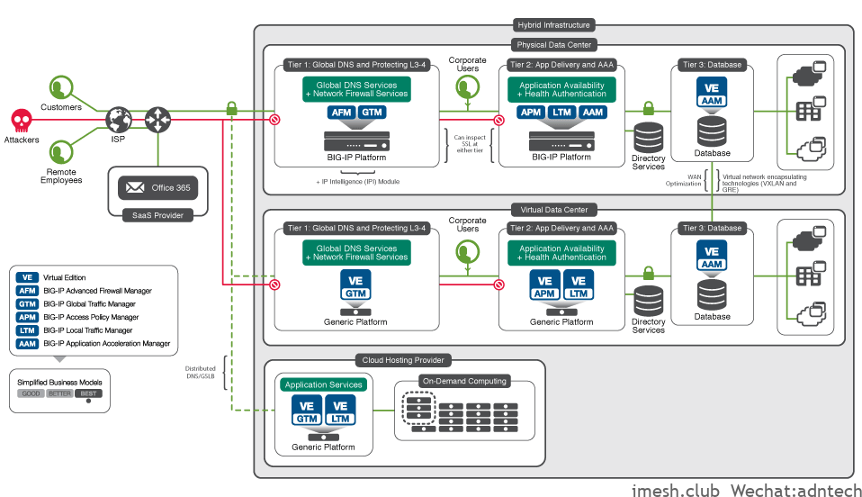
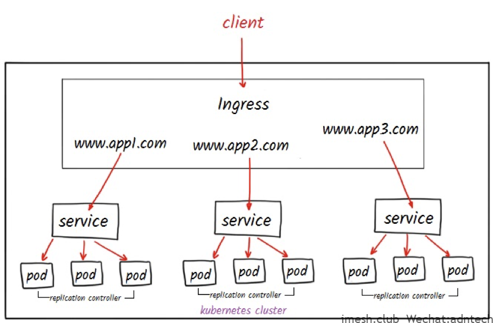

### Born to be simple(Load Balancing)

In the 1990s, the rapid development of the Internet gave birth to a large number of online websites, and the number of Web visits increased rapidly. At that time, a simple appeal was how to improve the access speed and ability of Web sites.

At that time, in the Six Arms bar on the slopes of downtown Seattle, several young people were here every night to enthusiastically discuss their entrepreneurial dreams. They were obsessed with human-computer interfaces and studied how to break through the limits of immersive virtual reality. . Michael Almquist was one of them. He found that the servers at the time could not meet their needs, so they studied the use of load balancing to help solve the problems they encountered.

In 1996, F5 Labs was established in a dilapidated office on the fifth floor of the Seattle Tower. Michael Almquist was the founder. Such a technology was discovered by investors, bringing F5 Labs from the field of virtual reality technology to a world that helps to achieve trouble-free and efficient Internet communication.

Alteon and Radware were also established in the same year as F5, but these two companies had stories with each other more than ten years later. Juniper was also established this year, and has had a consistent market with F5 in the following years.

Before the Internet bubble burst, this field basically revolved around how to load balance and optimize Web sites. Therefore, in the early days, there will be the term "Web switch". The basic idea is to achieve greater access capabilities by distributing connections to more different servers. When one server goes down, users can still access other available servers. The core technology is Load Balancing, and some Web optimization capabilities are added. The basic technical deployment patterns are as follows:

In 1997, F5 released the BIG-IP product. The earliest name of BIG-IP is actually called BIG/IP, which is derived from the name TCP/IP. BIG expresses the meaning of a super IP representing many backing service IPs. In the same year that BIG-IP was released, a company called ArrowPoint was established, mainly for web optimization.

In 1998, F5 released the 3DNS product. On Load Balancing, DNS has always been an original technology. 3DNS products expand the concept of space (source, target) and time (availability) on top of the basic technology of DNS polling and resolution, forming three dimensions (3D), which is also 3DNS The origin of the naming was later changed to Global Traffic Management (GTM). In recent years, it was also named DNS to express a complete and comprehensive enterprise DNS architecture. We can actually see the focus of the market direction at different stages from the name change. The use of smart DNS technology has helped to further enhance the Web access experience, allowing users to access the nearest available site in time. The technical concepts used in 3DNS are still widely used today, whether it is global traffic management or enterprise basic DNS. In the same year, the industry also established two companies, uRoam and Netscaler. One was later acquired by F5, and the other was a company in the same field of F5.

### Success in ADC

The Internet bubble reached its peak in 2000, and this year was also the year when the most relevant manufacturers in this field were established. Fineground, a web optimization, application acceleration and security vendor; application front-end optimization vendor Redline; WAN optimization vendor Peribit. Application security vendor Magnifire. At the same time Array was also established this year. If we look through the information, we will find that at this stage the market will have a lot of terms about products. In addition to the "Web switches" mentioned above, there are also "content switches", four-layer switches, and seven-layer switches. Manufacturers of different technical backgrounds are engaged in a secret struggle.

In 2001, the U.S. stock market plummeted and the Internet company bubble burst. The business model of simply relying on simple Load Balancing for Internet Web sites is no longer sustainable. Combing the acquisitions in this field from 2000 to 2005, we can see that the market has become complicated, with a large number of manufacturers established and a large number of manufacturers acquiring:

- In 2000, Cisco acquired ArrowPoint, and Fineground, which was created in the same year, was also acquired by Cisco in 2005. Through this acquisition, Cisco finally completed the construction of its application content network (AON) technology products.
- In 2003, F5 acquired uRoam and built an APM module for SSL VPN and access identity and policy management.
- In 2004, F5 acquired Magnifire to build WAF product capabilities. That is, the current Advance WAF module.
- In 2005, F5 acquired Swan Labs to enrich the capabilities of WAN acceleration, the later WOM module.
- In 2005, Citrix acquired Netscaler, which became its later application delivery product.
- In 2005, Juniper built its application-oriented product line through the acquisition of Peribit and Redline.

And behind this frenzy, a standardized market area is being shaped. It can be seen from the acquisition technology direction of the above-mentioned vendors that the technology trend at the time was relatively clear, and the market was focusing on how to access applications faster and more securely, and to ensure that the applications were available for construction.

In 2003, Gartner defined the Application Delivery Controller (ADC) concept for the first time. In the early days, the definition of ADC was still mainly a combination of load balancing technology and offloading technology, and it was Web-oriented. The latest definition is:

> The Application Delivery Controller (ADC) is deployed in the data center and optimizes application performance, security, and resource efficiency by offloading servers, providing in-depth payload inspection, and making full use of complex protocols. They were originally deployed for external-facing Web applications and are now used to provide services for many types of business applications and protocols.

It can be seen that later ADC products are more oriented towards the processing of complex applications in enterprises. This is why there are arguments that ADC should become a platform, which has attributes similar to middleware to help companies better deliver applications.

The stock market crash caused companies in this field to consider shifting technology application scenarios from Internet Web sites to enterprise applications. 2002 was the most critical year for F5. This year, F5 established TMOS (Traffic Management Operating System) as the foundation of BIG-IP. This real-time event-driven traffic operating system established F5's leading position in the application delivery network (ADN) field. The three consecutive acquisitions in 2003, 2004, and 2005 helped quickly form a complete ADC product line.

The TMOS V9 version was released in 2004, bringing the market into a new development track. In mid-2005, Gartner announced that F5 had achieved the highest ADC market share.

2006 is a sign of the maturity of the ADC market. The ADC technology represented by F5 has formed a de facto standard in the field. The products have formed a wealth of connection management, protocol control, SSL offloading, Web compression and optimization, traffic shaping, DoS protection, Web security, IPv6, link load, GSLB, etc. Application delivery capabilities. The technical architecture deployment is basically similar to the following figure:

Consolidating a mature market is not an easy task. It requires continuous investment in technology research and development to ensure competitiveness in the industry. The period from 2006 to 2008 was a period of very high growth in F5 R&D investment in history. Although it was during the global economic crisis, the quarter-on-year growth of R&D investment remained between 30%-40%.

At this time, several large companies in the same field are disproportionate in their R&D investment and market revenue. Whether it is due to lack of investment or technical route issues, they eventually withdraw from the market due to lack of technical competitiveness.

- Juniper abandoned its DX product line in 2008 and announced its withdrawal
- Nortel ended in 2009, Radware acquired Alteon assets
- In 2010, Cisco stopped selling AON and ACE XML gateway products
- In 2012, Cisco officially stopped ACE research and development

The failure cases of Nortel, Cisco, and Juniper fully illustrate that the ADC field is a high-tech market. It requires continuous technological accumulation and continuous technological breakthroughs. For a long time, F5's annual R&D investment accounts for approximately 17%-18% of its revenue, which is higher than the 15.7% average of the software and Internet industries. The annual R&D investment is close to 5 times the revenue of the F5 Chinese market in the same year. Continuous high R&D investment has ensured F5's leading position in technology in the industry.

It is precisely because of the maturity of ADC products that around 2009, the market once made the argument that Load Balancing was dead to emphasize that companies should attach importance to the capabilities of ADC products. F5 ADC products have rich application-oriented capabilities, such as rich and in-depth protocol control, event-based programmable architecture, connection-oriented refined management, high dynamic configuration without reload, comprehensive automation and API interfaces, and rich The observable ability. Enterprises can fully open up these capabilities and provide them to application teams and middleware teams.

At this stage of the rapid development of ADC products, another field is also constantly developing, which is the soft load field represented by NGINX and HAproxy.

NGINX began to develop in September 2004, and HAproxy began to develop in December 2005. The origins of these two products are similar to those of F5, and they are both developed for the actual needs of their own business. NGINX is to solve the high concurrency problem of the website, and HAproxy is to solve the problem of application session retention of the author's own security company. Eventually evolved into today's typical reverse proxy software.

In terms of time, since ADC hardware products were established in 2003, soft load products have developed together with hardware ADC products. The use of soft load by cloud and top Internet companies has accelerated the application of soft load product scenarios, exposing it to the public and being understood by more people. Whether it is LVS, Tengine, Openresty, ELB, etc.

2016 is the inflection point of the enterprise market's perception of soft load. With the further development of enterprises' digital transformation, DevOps, dual-mode IT, elastic architecture, and enterprise private cloud, soft loads have begun to be widely mentioned and applied.

Based on the understanding of the soft load market, F5 has released the Virtual Edition (VE) of TMOS since 2009, actively building the cloud initialization capabilities of related products, strengthening the ecological construction of DevOps tools such as Ansible/Terraform modules, etc., open command and statement -Style interface to achieve more Gitops capabilities. These capabilities allow companies to deploy F5 VE soft ADC products faster and better to meet business needs. There is an interesting number. F5 has deployed 50,000 sets of hardware devices in China in 19 years, with an average of more than 2,600 units per year. During the 2020 Spring Festival epidemic alone, it quickly helped users deploy 3000 sets of software ADCs. The advantages of easy deployment of soft loads have been greatly brought into play.

Subsequently, in 2019, F5 acquired NGINX to further strengthen the soft load market.

### Back to Simple- Service Proxy

With the development of application architecture, applications are transforming from traditional monolithic applications to distributed or microservices. Whether it is a distributed or microservice architecture, its core is to split multiple services of an application to form a relatively independent service unit. The direct result of the split is that an additional mechanism is needed to ensure that these independent work units can coordinate and unified work, which is inseparable from distributed computing, storage, messaging, and so on. When these independent service units need to communicate with each other, it is necessary to think about how to make these services that communicate through the network more reliable, safer, and more optimized. This is what the field of application delivery is concerned about, but it has changed from user-oriented and network-oriented to service-oriented. We call it Service Proxy.

Access gateways in distributed systems or API gateways for microservices are typical ADC requirements, such as identity recognition, SSL offloading, content routing, application security, current and speed limiting, DDOS, etc. These scenarios have been driven by developers for a long time. Due to the characteristics of the software, it is easier for developers to access software products like NGINX. This is a typical change in user roles compared to traditional ADC products.

In environments such as microservices and cloud natives, the communication interface between services is simpler and more unified, which makes the technical requirements for reverse proxy software simpler, and no longer need such a complex and rich special protocol support , No longer need complex network technical characteristics requirements. What is needed is for soft load products to have more dynamic configuration, which can be linked with the registration center and configuration center to realize the discovery of services and the introduction of strategies. The products need to be lightweight and easy to deploy and suitable for virtual machines, containers, etc. The use of these scenarios requires fast enough performance, sufficient observable data, and sufficient flexible deployment capabilities.

(Under cloud native, it is difficult to directly see a concrete load balancer)

Around 2017, with the development of cloud native, Service Proxy began to appear in large numbers. There are endless products around Ingress Controller, Sidecar, API Gateway, such as Linkerd, Envoy, Gloo, Mosn and so on. From traditional ADC to today's service-centric modern lightweight decoupled Service Proxy, the technology is returning to a simple Web-oriented load balancing era, client-side load balancing or server-side load balancing.

At the end of 2017, F5 launched Aspen Mesh, a commercial service mesh solution product based on Istio. Help users use service grid technology more reliably.

In 2019, F5 acquired NGINX. Based on NGINX to create modern application API gateway, K8S Ingress Controller, cloud native application protection, NGINX service grid and other product solutions.

In 2021, F5 acquired the start-up Volterra. Help enterprises realize multi-cloud and edge application management based on K8S technology.

The launch of these products allows F5 to quickly cover the three directions of cloud-native Service Proxy development.

(Three directions of Service Proxy development under cloud native)

### Facing the current- Enterprise Cloud Native Application Service

When we return to the actual situation of the enterprise and use a picture to express the changes in this related field, we can see that the deployment position of products in the related field is constantly improving, from basic network hardware to a cloud environment. The service component has become a logical resource object in the cloud native environment. From visible and tangible to visible and intangible, from visible and intangible to invisible and intangible. Enterprises should pay full attention to the selection of soft load products that can cover all scenarios to ensure that they can evolve their enterprise application architecture under unified technology and professional services to avoid technical risks.

(Load balancing, an ever-increasing position)

Cloud native architecture is the future direction of enterprises, but the cloud native architecture of enterprises will not be achieved overnight. It must evolve slowly on top of the company's existing IT infrastructure. In such an evolutionary process, the cloud native environment that the company is building needs to use the company's existing infrastructure. The existing infrastructure of the enterprise must also be changed to the cloud-native environment, and the two need to be integrated with each other.

This is true for infrastructure and so are people. With the improvement of enterprise platform-based capabilities, we can clearly see that I&O personnel are becoming the main force of future data center technology innovation. The leading role personnel in this field have changed from network personnel to developers, and ultimately to platform personnel.

### Conclusion

It can be seen that from 1996 to 2006, and then to 2016. Every 10 years of changes in the application delivery field have echoed the changes in market demand and are in line with the changes in application architecture. From simple Web load balancing to complex enterprise application delivery, from monolithic applications to distributed, microservice architecture. The target audience also ranges from network personnel to application personnel to today's platform and infrastructure personnel. Whether it is the complexity of ADC functions or the simplicity and efficiency of Service Proxy, products in the application delivery field have become the most important infrastructure components for enterprises.